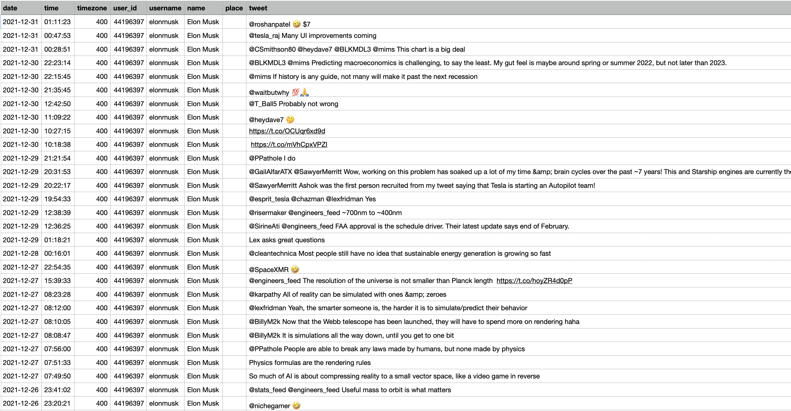

# Prove that you are a Super Charged Data Engineer!

Submit a pull request from your own fork to this repo, to super-charge your Data Engineer job application at Teraflow.

## The brief

You are consulting on new Cryptocurrency Trading start-up __*CryptoDudez*__'s Machine Learning project.

They would like to automate their Ethereum trades by making use of machine learning on a scalable and cost-effective cloud solution on either AWS or GCP and require your help in scoping out the solution architecture, as well as building a minimal proof of concept solution within 7 days.

## The data

__*CryptoDudez*__ have made use of some interns to gather historical crypto prices and have provided this to you in the archive: `cryptocurrency_historical_prices.zip`. 

They have also gathered some of Elon Musk's historical tweets in the archive `elon_musk_tweets.zip` 

And stock market tickers in the archive `stock_prices_2020_2021.zip`

Their ultimate goal is to train an ML model which will predict whether to buy, sell or [HODL](https://www.nerdwallet.com/article/investing/hodl-a-typo-takes-hold-as-a-sound-cryptocurrency-strategy) their current Ethereum stockpile. But before any fancy Machine Learning work can commence, they need some serious Data Engineering know-how to get their environment ready to enable this AI use-case.

## The requirements

### Data Lake

__*CryptoDudez*__ would like the cryptocurrency data, as well as any additional datasources to be stored in their raw form on a Data Lake layer.

Upon landing in the data lake, an automated process should be kicked off which catalogs the raw data's location, and infers the column names and datatypes contained therein. 

Once the structure and location of the data has been established and persisted in a metastore, a process needs to run various data validation checks (null checks, non-conformant schema checks, unprocessable rows, corrupt data) and lastly, the data needs to be converted to parquet format. 

Any rows or files that were not processable should be stored in a seperate location for later review.

### Feature Store

After this basic ingestion process has concluded, a number of "features" need to be calculated to train a machine learning model. These features need to be calculated in a scalable fashion (assume that the size of the input data has the potential to be many Terabytes in size).

Some of the features requested include:

- The number of tweets Elon makes per day
- The number of likes per tweet, as well as the number of likes per day
- The number of retweets and replies his tweets generate
- Some form of numeric encoding/ representation of the tweets, with emojis, stopwords, @mentions and other non-informative or non-linguistic elements removed
- A sensible representation of the cryptocurrency and stockmarket data, which allows for all of these tickers to be tied back to (used as predictors for) the price of Ethereum

Please note that the calculation of the features should be an event-driven process, triggered by ingestion into the datalake.

It is up to you to recommend the persistence-, consumption- and governance layers of the feature store.

### Data Analysis

As an example use-case, consider the stock prices for Dogecoin and Elon Musk's tweets in 2019. Connstruct a feature in your feature store that looks at the frequency of the term "dogecoin" in Elon's tweets over a window period of 1 day. Compare it to the stock price of dogecoin over the duration of 2019 and investigate any observable trend/s. Present/use your findings as you see fit.

### Added extras

For bonus credit, you can spend what time you have left (or are willing to spend) to conduct further investigations: Can you find more trends in the data? Are there other meaningful correlations? Can you train a basic machine learning model to predict crypto prices making use of the data (for example for the use-case explored in the data analysis section), or alternatively you might wish to templatise your code into a reusable Python package, or build some ML Feature Store capabilities, such as data-drift detection, dataset metadata; another option could be to indicate how a machine learning model trained on this data would be deployed behind an API and/ or how such a model could be retrained... whatever you feel will impress your client the most, given the tight deadline and the areas of expertise you are personally more comfortable with.

## Your final submission should include:

* At Teraflow, we usually scope out our project requirements in a "Sprint Zero" phase, where we would come up with some solution diagrams before we start building, to simulate this we'd like you to draw up an architectural diagram for your solution as part of your submission.
* Infrastructure as Code to deploy the various cloud resources needed to make your solution work
* The code assets which would allow this solution to fulfil the minimum viable product requirements
